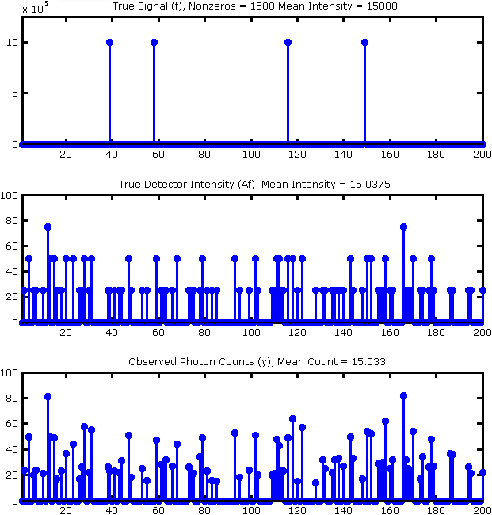
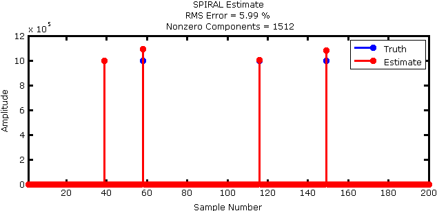
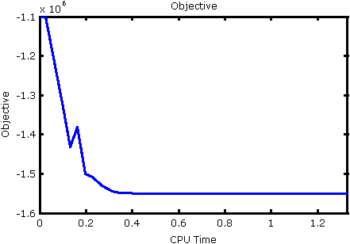
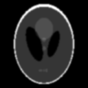
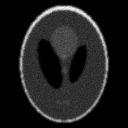
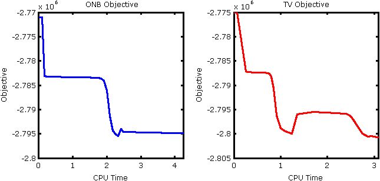
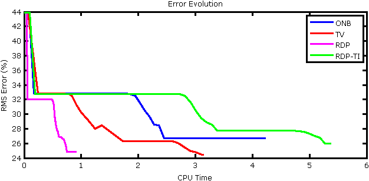
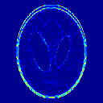
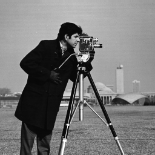

[Download SPIRALTAP][SPIRALTAPDownload]

## Overview ##

The Sparse Poisson Intensity Reconstruction ALgorithms (SPIRAL) toolbox, ``SPIRALTAP``, is MATLAB code for recovering sparse signals from Poisson observations. SPIRAL minimizes a regularized negative log-likelihood objective function with various penalty choices for the regularization terms:

- Sparsity ($\ell_1$ norm) of the coefficients in an orthonormal basis, denoted SPIRAL-ONB,
- Total Variation seminorm (TV) of the image, denoted SPIRAL-TV,
- Penalty based on Recursive Dyadic Partitions (RDPs) denoted SPIRAL-RDP, and
- Penalty based on translationally-invariant (cycle-spun) RDPs, denoted SPIRAL-RDP-TI.

For more details, see our paper (available on [IEEE Xplore][SPIRALTIP] and [arXiv][SPIRALarXiv]):

Z. T. Harmany, R. F. Marcia, and R. M. Willett, ``This is SPIRAL-TAP: Sparse Poisson Intensity Reconstruction ALgorithms -- Theory and Practice,'' IEEE Transactions on Image Processing, vol. 21, pp. 1084–1096, Mar. 2012.

To aid users, we provide a few examples of our algorithm. To view a demonstration, execute in MATLAB
> SPIRALdemo
switching the variable ``demo`` in ``SPIRALdemo.m`` to ``1``, ``2``, or ``3`` selects among three simulations. Details of each can be found below. 

**Note**: Some of these demonstrations utilize the [Rice Wavelet Toolbox][RWT] (freely available online) to compute the discrete wavelet transform. We include this toolbox here (although it may need to be recompiled on your platform). We also use the [FISTA][FISTA] algorithm (in the ``denoise`` directory) of Beck and Teboulle for constrained total variation denoising.

## Demonstration 1 ##

Description: One dimensional compressed sensing example penalizing the sparsity ($\ell_1$ norm) of the coefficients in the canonical basis. Here the true signal $f$ is of length 100,000 with 1,500 nonzero entries yielding a sparsity of 1.5%. We take 40,000 compressive measurements in $y$. The average number of photons per measurement is 15.03, with a maximum of 145. We run SPIRAL until the relative change in the iterates falls below a tolerance of 1e-8, up to a maximum of 100 iterations (however only 37 iterations are required to satisfy the stopping criterion). 

Output: This demonstration automatically displays Figures 1 through 4.

Figure 1: Simulation setup (true signal, true detector intensity, observed counts). Note, this figure is zoomed to the first 200 samples only.

Figure 2: Reconstructed signal (red) overlaid on the true signal (blue). Note, this figure is zoomed to the first 200 samples only.

Figure 3: RMS error evolution versus computation time. 

Figure 4: Objective evolution versus computation time.

## Demonstration 2 ##

Description: Here we consider an image deblurring example. The true signal is a 128 $\times$ 128 Shepp-Logan phantom image with mean intensity 1.22e5. The true detector mean intensity is 45.8, and the observed photon count mean is 45.8 with a maximum of 398. Here we consider four penalization methods:

- Sparsity ($\ell_1$ norm) of coefficients in an orthogonal (wavelet) basis,
- TV of the image,
- Penalty based on RDPs, and
- Penalty based on translationally-invariant (cycle-spun) RDPs.

We run all the SPIRAL methods for a minimum of 50 iterations until the relative change in the iterates falls below a tolerance of 1e-8, up to a maximum of 100 iterations (however, only about 70 iterations are required to satisfy the stopping criterion for all methods).

Output: This demonstration automatically displays Figures 5 though 9. Since this is an image processing example, we explicitly show the outputs.

| &nbsp;&nbsp;True Signal&nbsp;&nbsp; | &nbsp;&nbsp;True Detector Intensity&nbsp;&nbsp; | &nbsp;&nbsp;Observed Photon Counts&nbsp;&nbsp; |
|:---:|:---:|:---:|
|  |  | 

Figure 5: Simulation setup.

Figure 6: The objective evolution for the methods where explicit computation of the objective is straightforward.

Figure 7: Normalized RMS error evolution versus computation time.

| SPIRAL-ONB      | SPIRAL-TV        |
|:----------:|:----------:|
| RMSE (%) = 24.83       | RMSE (%) = 25.97 |
|  |  |
| SPIRAL-RDP | SPIRAL-RDP-TI |
RMSE (%) = 24.83 | RMSE (%) = 25.97 |
|  |  |

Figure 8: Final reconstructions.

| SPIRAL-ONB      | SPIRAL-TV        |
|:----------:|:----------:|
| RMSE (%) = 24.83       | RMSE (%) = 25.97 |
|   |  |
| SPIRAL-RDP | SPIRAL-RDP-TI |
RMSE (%) = 24.83 | RMSE (%) = 25.97 |
|  |  |

Figure 9: Magnitude of the error between the final reconstruction and the true phantom image. Note, the color scale indicates percentage difference over all reconstructions.

## Demonstration 3 ##

Description: This demonstration is similar to Demonstration 2, but uses the 256 $\times$ 256 ``cameraman`` image instead of the Shepp-Logan phantom. The true signal has a mean intensity of 1.19e5, the true detector mean intensity is 44.4, and the observed photon count mean is 44.4 with a maximum of 111. Due to the larger problem size, we need to alter the termination criteria. We run all the SPIRAL methods for a minimum of 50 iterations until the relative change in the iterates falls below a tolerance of 1e-8, up to a maximum of 300 iterations. 

Output: Like Demonstration 2, this demonstration automatically displays a similar set of images, shown in Figures 10 through 14.

|  True Signal  |  True Detector Intensity  |  Observed Photon Counts  |
|:---:|:---:|:---:|
|  |  | 

Figure 10: Simulation setup.

Figure 11: The objective evolution for the methods where explicit computation of the objective is straightforward.

Figure 12: Normalized RMS error evolution versus computation time.

| SPIRAL-ONB      | SPIRAL-TV        |
|:----------:|:----------:|
| RMSE (%) = 24.83       | RMSE (%) = 25.97 |
|  |  |
| SPIRAL-RDP | SPIRAL-RDP-TI |
RMSE (%) = 24.83 | RMSE (%) = 25.97 |
|  |  |

Figure 13: Final reconstructions.

| SPIRAL-ONB      | SPIRAL-TV        |
|:----------:|:----------:|
| RMSE (%) = 24.83       | RMSE (%) = 25.97 |
|   |  |
| SPIRAL-RDP | SPIRAL-RDP-TI |
RMSE (%) = 24.83 | RMSE (%) = 25.97 |
|  |  |

Figure 14: Magnitude of the error between the final reconstruction and the true phantom image. Note, the color scale indicates percentage difference over all reconstructions.

[SPIRALTAPDownload]: SPIRALTAP.zip "SPIRALTAP.zip"
[SPIRALTAP]: spiraltap.html "This is SPIRAL-TAP"
[SPIRALTIP]: http://dx.doi.org/10.1109/TIP.2011.2168410 "SPIRAL on IEEE Xplore"
[SPIRALarXiv]: http://arxiv.org/abs/1005.4274 "SPIRAL on arXiv"
[RWT]: http://dsp.rice.edu/software/rice-wavelet-toolbox "Rice Wavelet Toolbox"
[FISTA]: http://ie.technion.ac.il/~becka/papers/tv_fista.zip "FISTA"

